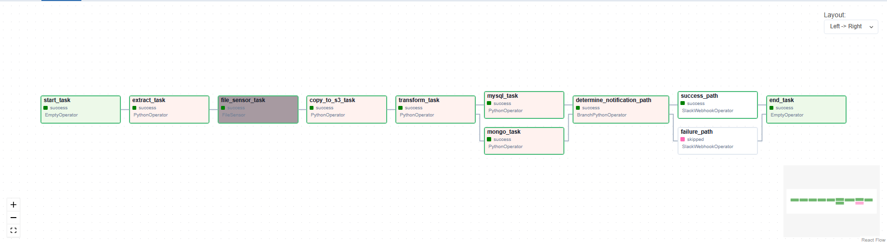
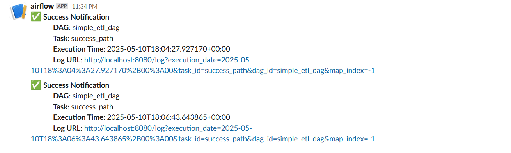
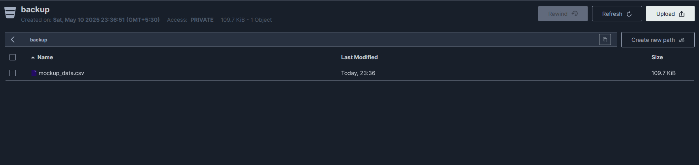
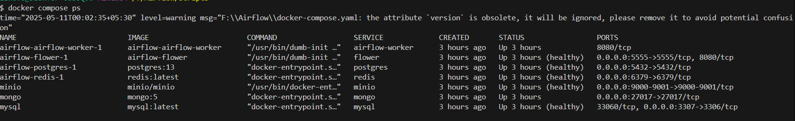
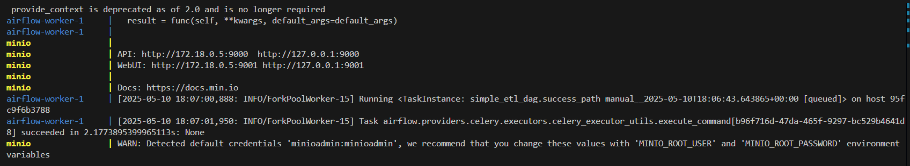
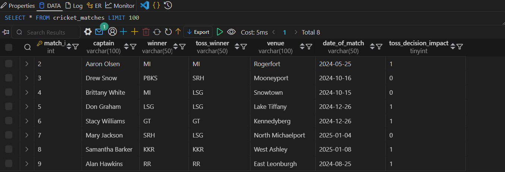
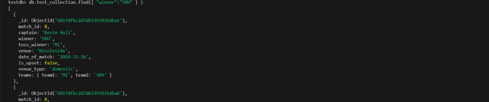

# dockerized-airflow-etl
A complete Apache Airflow ETL pipeline stack using Docker Compose, featuring MySQL, MongoDB, MinIO (S3), Slack notifications, and Flower for monitoring. Easily orchestrate, transform, and load data with ready-to-use Airflow DAGs and integrations.

---

## Features

- **Airflow**: Orchestrates the ETL pipeline using Python DAGs.
- **MySQL & MongoDB**: Stores transformed data.
- **MinIO**: S3-compatible object storage for file uploads.
- **Slack**: Sends notifications on DAG completion.
- **Redis & Flower**: Supports CeleryExecutor and task monitoring.
- **PostgreSQL**: Airflow metadata database.
- **File Sensors**: Waits for files before processing.

---

## Folder Structure

```
Airflow/
├── dags/                # Airflow DAGs (ETL logic)
├── data/                # Input/output data files
├── logs/                # Airflow logs
├── plugins/             # Custom Airflow plugins (if any)
├── scripts/             # Helper scripts
├── docker-compose.yaml  # Docker Compose setup
├── Dockerfile.airflow   # (If present) Custom Airflow image
└── README.md            # Project documentation
```

---

## Getting Started

### Prerequisites

- [Docker](https://www.docker.com/products/docker-desktop)
- [Docker Compose](https://docs.docker.com/compose/)

### Setup

1. **Clone the repository:**
   ```sh
   git clone https://github.com/logarajeshwaran/dockerized-airflow-etl.git
   cd Airflow
   ```

2. **Start the services:**
   ```sh
   docker-compose up -d
   ```

3. **Access Airflow UI:**
   - Open [http://localhost:8080](http://localhost:8080)
   - Default login:  
     - Username: `airflow`  
     - Password: `airflow`

4. **Access other services:**
   - **Flower**: [http://localhost:5555](http://localhost:5555)
   - **MinIO**: [http://localhost:9000](http://localhost:9000)  
     - Username: `minioadmin`, Password: `minioadmin`
   - **MySQL**: `localhost:3307` (user: `airflow_user`, pass: `airflow_pass`)
   - **MongoDB**: `localhost:27017` (user: `mongoadmin`, pass: `secret`)

---

## Airflow Connection Strings

Set up these connections in the Airflow UI under **Admin → Connections**:

### MySQL

- **Conn Id**: `fs_connection_id`
- **Conn Type**: `File`
- **Path**: `/opt/airflow/data/`

### MySQL

- **Conn Id**: `mysql_default`
- **Conn Type**: `MySQL`
- **Host**: `mysql`
- **Schema**: `airflow_db`
- **Login**: `airflow_user`
- **Password**: `airflow_pass`
- **Port**: `3306`

### MongoDB

- **Conn Id**: `mongo_default`
- **Conn Type**: `MongoDB`
- **Host**: `mongo`
- **Schema**: `testdb`
- **Login**: `mongoadmin`
- **Password**: `secret`
- **Port**: `27017`
- **Extras**:
  ```json
  {
    "allow_insecure": "false"
  }
  ```

### MinIO (S3)

- **Conn Id**: `minio_conn`
- **Conn Type**: `S3`
- **Host**: `http://minio:9000`
- **Login**: `minioadmin`
- **Password**: `minioadmin`
- **Extra**:
  ```json
  {
    "aws_access_key_id": "minioadmin",
    "aws_secret_access_key": "minioadmin"
  }
  ```

---

## Enabling Slack Webhook for Notifications

1. **Create a Slack App** in your workspace:  
   Go to [Slack API: Your Apps](https://api.slack.com/apps) and create a new app.

2. **Enable Incoming Webhooks**:  
   - Go to **Features → Incoming Webhooks**.
   - Activate Incoming Webhooks.
   - Click **Add New Webhook to Workspace** and select your channel.
   - Copy the generated **Webhook URL**.

3. **Add Slack Webhook Connection in Airflow**:  
   - Go to **Admin → Connections** in Airflow UI.
   - Click **+** to add a new connection.
   - **Conn Id**: `slack_webhook`
   - **Conn Type**: `Slack Webhook`
   - **Slack Webhook Endpoint**: *(Paste your Slack Webhook URL here)*
   - **Webhook Token**: *(Paste your Slack Webhook Token  here)*

4. **Update your DAG** to use `slack_webhook` as the connection ID for Slack notifications.

---

## Screenshots

Below are some screenshots of the ETL pipeline in action:

### Airflow DAG Overview



### Task Success Notification in Slack



### MinIO File Upload



### Checking Container Status

Shows the result of `docker-compose ps` with all services running:




### Viewing Logs

Sample output from `docker-compose logs --tail=20`:



###  MySQL Table Output

Shows the result of querying the target table after ETL completion:




###  MongoDB Collection Output

Shows the result of querying the MongoDB collection after ETL completion:



---

## Troubleshooting

- If you change database passwords or environment variables, remove volumes to reset data:
  ```sh
  docker-compose down -v
  docker-compose up -d
  ```
- Check logs in the `logs/` directory or via Docker:
  ```sh
  docker-compose logs <service>
  ```

---

## License

This project is licensed under the Apache 2.0 License.

---

**Happy ETLing!**